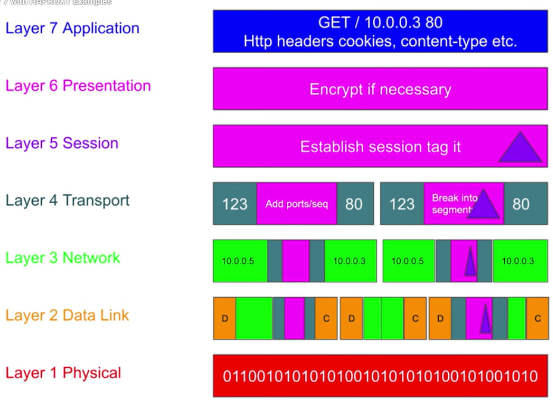

## Layer 7 (Application)
- http, smpt, header cookies
    - to actual data
## Layer 6 (Presentation)
- encryption
## Layer 5 (Session)
- 
## Layer 4 (Transport)
- ports are added 
    - and the type of protocol to use
## Layer 3 (Network)
- ip address is added
## Layer 2 (Data link)
- mac address is added
    - of the destination
## Layer 1 (Physical)
- things are in bits 0,1s
    - fiber, ethernet cable

https://youtu.be/eNF9z5JNl-A 
https://youtu.be/7IS7gigunyI